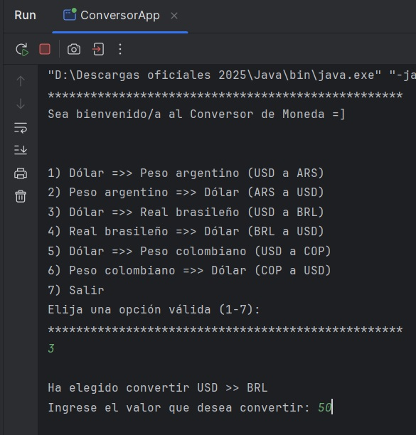
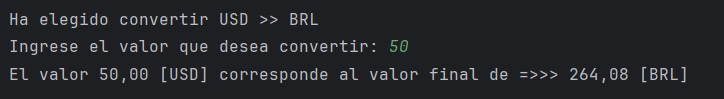

**<h1 align="center"> DESAFÍO CONVERSOR DE MONEDAS </h1>**
<h2 align="center">:dollar: EN PROCESO :dollar:</h2>
<h3 align="center">Alura Latam ONE. Practicando con Java: Challenge Conversor de Monedas.</h3>

    

----------------------------------------------------------------------------------------------------------

# :moneybag: Conversor de Monedas (Oracle ONE y Alura Latam)

Este proyecto es una aplicación de consola desarrollada en Java que permite a los usuarios realizar conversiones de moneda en tiempo real, obteniendo las tasas de cambio actualizadas a través de una API externa.

Este desarrollo cumple con el desafío propuesto en la formación **Oracle ONE de Alura Latam.**

## :hammer_and_wrench: Funcionalidades :hammer_and_wrench:

El programa ofrece un menú interactivo en la consola para realizar las siguientes conversiones:

- USD (Dólar estadounidense) → ARS (Peso argentino)

- ARS (Peso argentino) → USD (Dólar estadounidense)

- USD (Dólar estadounidense) → BRL (Real brasileño)

- BRL (Real brasileño) → USD (Dólar estadounidense)

- USD (Dólar estadounidense) → COP (Peso colombiano)

- COP (Peso colombiano) → USD (Dólar estadounidense)

## :grey_exclamation: Características técnicas destacadas

Lógica de Conversión: El cálculo se realiza mediante la fórmula Cantidad * Tasa_Obtenida.

Manejo de Errores: Incluye robustos bloques try-catch para gestionar excepciones de red (IOException), interrupciones (InterruptedException) y errores de formato de entrada (InputMismatchException o JsonSyntaxException).

Menú Iterativo: La aplicación utiliza un bucle do-while para mantener el menú activo hasta que el usuario decida salir **(opción 7).**

## :computer: Tecnologías y librerías 

Lenguaje: Java 17+

Conectividad: java.net.http.HttpClient (Clases HTTP nativas de Java).

Manejo de JSON: Gson 2.10.1 (Librería de Google para serialización/deserialización de objetos Java a JSON).

API Externa: ExchangeRate-API (Endpoint /pair/ para obtener tasas de conversión directa).

## :file_folder: Estructura del proyecto

El proyecto se separa en tres clases principales:

- ConversorApp.java (Interfaz y control): Contiene el método main(), gestiona el menú, lee la entrada del usuario (Scanner) y presenta el resultado final.

- ConsultaTasa.java (Servicio y conectividad): Se encarga de construir la URL con la API Key, realizar la solicitud HTTP y gestionar la conversión del JSON a un objeto Java mediante Gson.

- ConversionDatos.java (Modelo de datos): Clase simple para mapear el campo clave conversion_rate de la respuesta JSON.

## :thinking: Cómo ejecutar el proyecto

Para ejecutar este proyecto en tu entorno de desarrollo (IDE como IntelliJ IDEA o Eclipse), sigue estos pasos:

<ins>**1. Obtener la API Key**</ins>

Regístrate en ExchangeRate-API y obtén tu clave personal.

<ins>**2. Configurar la dependencia Gson**</ins>

Este proyecto requiere la librería Gson. Debe ser añadida como una dependencia externa (un archivo .jar) en tu proyecto:

Descarga el archivo gson-2.10.1.jar.

En tu IDE, añade este archivo al Classpath o como una Librería Externa de tu módulo.

<ins>**3. Insertar la API Key**</ins>

Abre el archivo ConsultaTasa.java y reemplaza la cadena de texto con tu clave API obtenida:

*private static final String API_KEY = "TU_CLAVE_AQUI";* // <-- **¡Reemplaza este valor!**

<ins>**4. Compilar y ejecutar**</ins>

Ejecuta la clase principal ConversorApp.java. La aplicación se iniciará en la consola, mostrando el menú de opciones.

